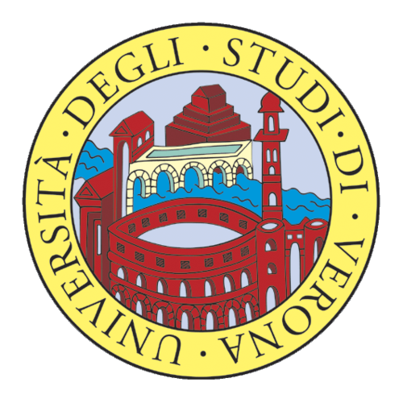
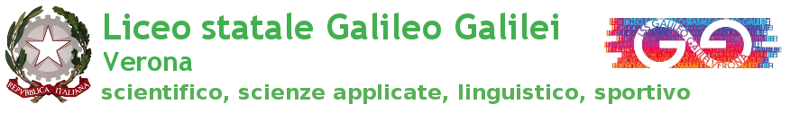
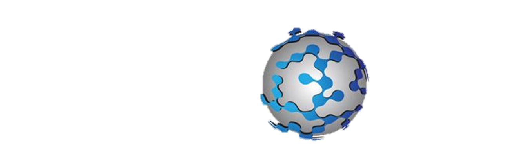

# intcatch asl luglio 2017       
 

A python software for reading logs captured from the INTCATCH boats
- Progetto sviluppato per l'Alternanza Scuola Lavoro 2017 dal 10/07/17 al 21/07/17.
- Autori Rossi Alice, Ricci Francesco e Bloisi Domenico.
- Liceo Scientifico Statale opzione scienze applicate ["Galileo Galilei"](https://www.galileivr.gov.it/)
- [Intcatch website](http://intcatch.eu/)

 
<h1>Attività svolte:</h1>

 
 1. Realizzazione di programma atto alla realizzazione di maschere di segmentazione.

 2. Modello di guida differenziale su robot LEGO MINDSTORM NXT.  

 
 3. Realizzazione del programma di lettura di Log e di visione dati su mappa. 

 
 4. Creazione e pubblicazione di video didattico-informativi.

 <h1> Diario delle lezioni: </h1>
<table class="classtable">
			<tr>
				<th>Data</th>
                                <th>Argomenti trattati </th>
			</tr>			<tr>
				<td>10/07/2017</td>
				<td>Aspetti organizzativi, basi python e creazione sito github</td>
			</tr>
			<tr>
				<td>11/07/2017</td>
				<td>Programmazione python, collaborazione nel realizzare un programma per la creazione di maschere.</td>
			</tr>
                        <tr>
				<td>12 Luglio 2017</td>
				<td>Sviluppo di una pagina Web, creazione watermask, ottimizzazione del programma atto alla creazione di maschere</td>           </tr>
			<tr>
			        <td>13 Luglio 2017</td>
	                        <td>Creazione video tutorial sull'utilizzo del programma, creazione di watermask</td>
			</tr>
			<tr>
				<td>14 Luglio 2017</td>
				<td>Modello di guida differenziale su robot LEGO MINDSTORM NXT, ottimizzazione del programma atto alla creazione di maschere</td>
			</tr>
			<tr>
				<td>17 Luglio 2017</td>
				<td>Realizzazione video tutorial sulla creazione interattiva di maschere di segmentazione, ottimizzazione del programma atto alla creazione di maschere</td>
			</tr>
			<tr>
				<td>18 Luglio 2017</td>
					<td>
											<ul>
												<li>Realizzazione del programma di lettura di Log e di visione dati su mappa</li>
												<li>Ottimizzazione del programma atto alla creazione di maschere</li>
											</ul>
										</td>

									</tr> 
									<tr>
										<td>19 Luglio 2017</td>
										<td>
											<ul>
												<li>Test delle barche autonome su lago</li>
												<li>Ottimizzazione del programma di lettura di Log</li>
												<li>Creazione video sull'esperienza al lago</li>
											</ul>
										</td>
									</tr>
									<tr>
										<td>20 Luglio 2017</td>
										<td>
											<ul>
												<li>Calcolo della distanza di un ostacolo partendo dalla sua posizione rispetto l'immagine</li>
												<li>Ottimizzazione del programma di lettura di Log</li
												<li>Ottimizzazione video sull'esperienza al lago</li>
											</ul>
										</td>
									</tr>
									<tr>
										<td>21 Luglio 2017</td>
										<td>
											<ul>
												<li>Finalizzazione del programma di lettura di Log</li>
												<li>Pubblicazione video sull'esperienza al lago</li>
											</ul>
										</td>
									</tr>
